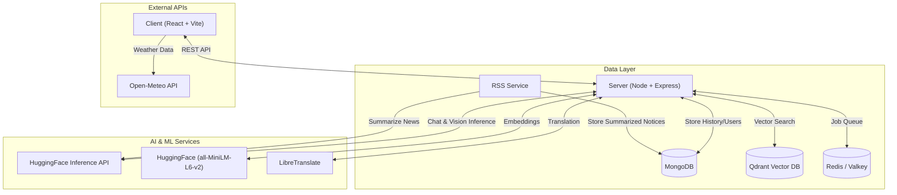
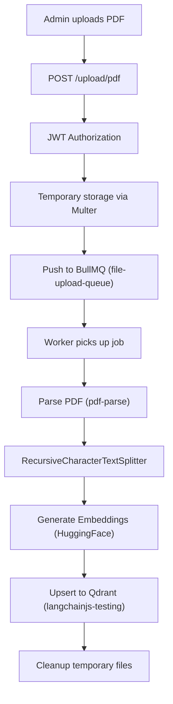
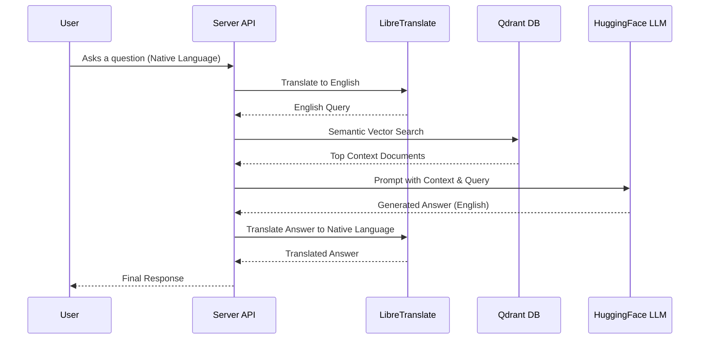

# AgroSathi 🌾
*The Intelligent Agriculture Assistant empowering farmers with AI-driven insights.*

AgroSathi is a comprehensive, AI-powered agricultural intelligence platform designed to support farmers by providing real-time, context-aware information. It combines a conversational interface with advanced capabilities like Retrieval-Augmented Generation (RAG) for localized agricultural documents, vision-based crop disease diagnosis, real-time weather integration, and curated agricultural news and government schemes.

## 🌟 Key Features

### 🤖 **Intelligent Agricultural Assistant (RAG)**
- **Document Grounding**: Ingests and processes agricultural PDFs, manuals, and guidelines to ensure answers are strictly based on authoritative sources, minimizing AI hallucinations.
- **Semantic Search**: Utilizes **Qdrant Vector Database** and **HuggingFace** embeddings (`all-MiniLM-L6-v2`) to retrieve the most relevant contextual information for every query.
- **Context-Aware Multi-Turn Conversations**: Maintains conversation history for seamless follow-up questions, understanding the flow of interaction.
- **Query Rewriting**: Employs an LLM (**Meta-Llama 3.1 8B Instruct**) to dynamically refine vague or incomplete follow-up questions into standalone queries for robust vector retrieval.

### 🍃 **Vision-Based Pest & Disease Detection**
- **Instant Visual Diagnosis**: Farmers can upload photos of affected crops, leaves, or pests for immediate analysis.
- **Advanced AI Analysis**: Powered by **Qwen 2.5 VL 7B Instruct** (Vision-Language Model) via HuggingFace Inference to detect and classify diseases with high accuracy.
- **Actionable Remediation**: Provides comprehensive severity assessments, immediate treatment recommendations, and long-term prevention measures.
- **Localized Output**: Diagnosis reports are automatically translated into the user's selected language.

### 🌐 **Seamless Multilingual Experience**
- **Real-Time Translation**: Breaks language barriers by translating both user queries and system responses on-the-fly using self-hosted **LibreTranslate**.
- **Supported Languages**: English, Hindi, Bengali, Tamil, Telugu, Marathi, Kannada, Malayalam, Gujarati, Punjabi, and Urdu.
- **Voice-to-Text Input**: Integrates speech recognition for accessible interaction, especially useful for farmers comfortable with native spoken languages, featuring visual waveform feedback.

### 🌤️ **Real-Time & Predictive Weather**
- **Hyper-Local Forecast**: Fetches current temperature, humidity, wind speed, and precipitation probability using the **Open-Meteo API**.
- **7-Day Forecasting**: Delivers detailed daily weather predictions, aiding in activity planning (e.g., sowing, harvesting, pesticide application).
- **Premium UI**: Designed with glassmorphism aesthetics, smooth animations (Framer Motion), and responsive dark mode support.

### 📰 **Agricultural News & Schemes Aggregation**
- **Automated RSS Ingestion**: A dedicated microservice fetches updates from various agricultural and governmental RSS feeds.
- **AI-Powered Summarization**: Processes complex, lengthy official notices into concise, farmer-friendly summaries using LLMs.
- **Scheduled Synchronization**: Driven by `node-cron`, the service runs reliably every 12 hours to keep the database updated.

### 🔐 **Secure & Robust Architecture**
- **Role-Based Authentication**: Secure JWT-based login for standard Users (Farmers) and Admins.
- **Persistent Chat Management**: Stores conversation histories in **MongoDB**, separating General Chat from Disease Detection logs. Features options to rename and delete individual sessions.
- **Admin Document Dashboard**: Secure portal for authorized personnel to upload, manage, and process reference documents (PDFs) into the RAG vector store.
- **Asynchronous Processing**: Employs **BullMQ** and **Redis/Valkey** to handle heavy background tasks like PDF parsing and embedding generation without blocking the main API.

---

## 🧩 Architecture & Workflows

### High-Level System Architecture



### RAG (Retrieval-Augmented Generation) Workflow

**1. Knowledge Ingestion (Admin)**


**2. Query Processing (User)**


---

## 📂 Comprehensive Project Structure

```
AgroSathi/
├── client/                     # Frontend React SPA
│   ├── src/
│   │   ├── components/         # Reusable UI elements
│   │   │   ├── chat/           # Chat interface components
│   │   │   │   ├── Sidebar.jsx
│   │   │   │   ├── WeatherWidget.jsx
│   │   │   │   └── NoticesWidget.jsx
│   │   │   └── ProtectedAdminRoute.jsx
│   │   ├── pages/              # Main application views
│   │   │   ├── Chatbot.jsx     # Core conversational UI
│   │   │   ├── DiseaseDetection.js
│   │   │   ├── Login.jsx & Signup.jsx
│   │   │   ├── AdminLogin.jsx & AdminUpload.jsx
│   │   │   └── Notices.jsx
│   │   └── utils/              # API wrappers, Auth helpers
│   ├── package.json
│   ├── vite.config.js
│   └── tailwind.config.js      # Theming and styling configuration
│
├── server/                     # Backend API & Workers
│   ├── config/                 # DB, AI, and Queue setups
│   ├── controllers/            # Route logic
│   │   ├── authController.js, chatController.js
│   │   ├── diseaseController.js, noticeController.js
│   │   └── uploadController.js
│   ├── middleware/             # JWT Auth, Multer
│   ├── models/                 # Mongoose Schemas (User, Chat, Notice, DiseaseDetection)
│   ├── routes/                 # API endpoints definition
│   ├── services/               # Core business logic
│   │   ├── aiService.js        # HuggingFace & LangChain integrations
│   │   ├── translationService.js # LibreTranslate wrappers
│   │   └── visionService.js    # Vision model interactions
│   ├── worker.js               # BullMQ worker for async PDF processing
│   ├── index.js                # Main Express server entry point
│   └── package.json
│
├── rss-service/                # Standalone Cron Service
│   ├── jobs/
│   │   └── rssExecutor.js      # RSS fetching and summarization logic
│   ├── index.js                # Cron initialization
│   └── package.json
│
└── docker-compose.yml          # Container orchestration
```

---

## 🏗️ Technology Stack

### **Frontend Layer**
- **Framework**: [React 19](https://react.dev/) with [Vite](https://vitejs.dev/)
- **Styling**: [Tailwind CSS](https://tailwindcss.com/)
- **Animations**: [Framer Motion](https://www.framer.com/motion/)
- **Icons**: [Lucide React](https://lucide.dev/)
- **Markdown Rendering**: `react-markdown`

### **Backend Layer**
- **Runtime**: [Node.js](https://nodejs.org/) (ES Modules)
- **Framework**: [Express.js](https://expressjs.com/)
- **Database**: [MongoDB](https://www.mongodb.com/) via Mongoose
- **Vector Search**: [Qdrant](https://qdrant.tech/)
- **Message Broker/Cache**: [Valkey](https://valkey.io/) / [Redis](https://redis.io/)
- **Background Jobs**: [BullMQ](https://docs.bullmq.io/)
- **AI Orchestration**: [LangChain.js](https://js.langchain.com/)

### **AI & Machine Learning Models**
- **Conversational LLM**: `Qwen/Qwen2.5-72B-Instruct` (via HuggingFace Inference API)
- **Vision/Disease Model**: `Qwen/Qwen2.5-VL-7B-Instruct` (via HuggingFace Inference API)
- **Query Refiner**: `meta-llama/Llama-3.1-8B-Instruct`
- **Embeddings**: `sentence-transformers/all-MiniLM-L6-v2`
- **Translation**: [LibreTranslate](https://libretranslate.com/) (Self-hosted via Docker)

---

## 🚀 Installation and Setup

### Prerequisites
- [Docker Engine & Docker Compose](https://www.docker.com/) (Recommended)
- [Node.js](https://nodejs.org/) (v18 or higher, if running locally)
- [pnpm](https://pnpm.io/) and npm
- A MongoDB cluster (e.g., MongoDB Atlas or local instance)

### Environment Variables (.env)

You need to create three `.env` files in the respective directories before starting the application.

**1. `server/.env`**
```env
PORT=8000
MONGODB_URI=your_mongodb_connection_string
JWT_SECRET=your_secure_user_jwt_secret
ADMIN_USERNAME=admin
ADMIN_PASSWORD=your_admin_password
ADMIN_JWT_SECRET=your_secure_admin_jwt_secret
HUGGINGFACE_API_KEY=your_huggingface_access_token
QDRANT_URL=http://qdrant:6333
REDIS_HOST=valkey
REDIS_PORT=6379
LIBRETRANSLATE_URL=http://libretranslate:5000
```

**2. `client/.env`**
```env
VITE_API_BASE=http://localhost:8000
```

**3. `rss-service/.env`**
```env
MONGODB_URI=your_mongodb_connection_string
HUGGINGFACE_API_KEY=your_huggingface_access_token
```

### 🔑 Acquiring the HuggingFace API Key
1. Register/Login at [HuggingFace](https://huggingface.co/).
2. Navigate to **Settings > Access Tokens**.
3. Create a new token with **Read** permissions.
4. Copy the token into your `.env` files.

---

## 🐳 Running with Docker (Recommended)

The easiest way to run the entire stack (Frontend, API Backend, Worker, RSS Service, Qdrant, Valkey, and LibreTranslate).

1. Clone the repository and configure `.env` files as shown above.
2. Build and start the containers:
   ```bash
   docker-compose up --build
   ```
3. Access the services:
   - **Frontend App**: `http://localhost:5173`
   - **Backend API**: `http://localhost:8000`
   - **Qdrant Dashboard**: `http://localhost:6333/dashboard`
   - **LibreTranslate UI**: `http://localhost:5000`

---

## 💻 Running Locally (Manual Setup)

If you prefer to run services manually for development:

**1. Infrastructure Services**
Start Qdrant and Valkey/Redis (you can use docker just for these):
```bash
docker run -p 6333:6333 qdrant/qdrant
docker run -p 6379:6379 valkey/valkey
```

**2. Backend API**
```bash
cd server
pnpm install
pnpm dev
```

**3. Backend Background Worker** (In a new terminal)
```bash
cd server
pnpm dev:worker
```

**4. Frontend Client** (In a new terminal)
```bash
cd client
npm install
npm run dev
```

**5. RSS Aggregation Service** (In a new terminal)
```bash
cd rss-service
npm install
npm run dev
```

---

## 📚 API Endpoints Documentation

### **Authentication (`/auth` & `/admin`)**
- `POST /auth/signup` - Register a new user (Farmer).
- `POST /auth/login` - Authenticate a user and receive a JWT.
- `POST /admin/login` - Authenticate an admin and receive an Admin JWT.

### **Chat & RAG (`/chat`)**
- `POST /chat/create` - Initialize a new conversation thread.
- `GET /chat/list` - Retrieve all conversation threads for the authenticated user.
- `GET /chat/history/:chatId` - Retrieve messages for a specific chat.
- `POST /chat` - Send a message to the RAG system and get an AI response.
- `DELETE /chat/:chatId` - Delete a conversation thread.
- `PUT /chat/:chatId/rename` - Rename a chat thread title.

### **Disease Detection (`/chat/disease*`)**
- `POST /chat/disease/create` - Initialize a new disease detection log.
- `POST /chat/disease-detect` - Upload an image (Multipart form data) for visual diagnosis.
- `GET /chat/disease/history/:chatId` - Retrieve historical diagnosis results.

### **Admin Actions (`/upload`)**
- `POST /upload/pdf` - Upload PDF documents to be processed by the BullMQ worker and ingested into Qdrant. Requires Admin JWT.

### **Notices (`/api/notices`)**
- `GET /api/notices` - Fetch paginated notices/schemes.
  - Query Params: `page`, `limit`, `type` (`GOVERNMENT` | `AGRI_NEWS`)

---

## 🗄️ Database Models Overview

- **User**: Stores credentials and preferences.
- **Chat**: Stores conversation history threads (both general Q&A and disease detection logs).
- **Notice**: Stores summarized RSS feed items categorized by type and date.
- **DiseaseDetection** (Embedded or relation): Stores image metadata, diagnosis results, and AI recommendations.

---

## 🔮 Future Enhancements
- **SMS / WhatsApp Integration**: Allow farmers to query the system via WhatsApp or SMS without needing a smartphone app.
- **Market Price Integration**: Real-time integration with agricultural mandis to provide crop price forecasts.
- **IoT Sensor Sync**: Direct integration with soil moisture and temperature sensors to provide proactive alerts.

---

## 🤝 Contributing
Contributions are highly encouraged! 
1. Fork the Project
2. Create your Feature Branch (`git checkout -b feature/AmazingFeature`)
3. Commit your Changes (`git commit -m 'Add some AmazingFeature'`)
4. Push to the Branch (`git push origin feature/AmazingFeature`)
5. Open a Pull Request

## 📄 License
This project is open-source and available under the **MIT License**.

## 🙏 Acknowledgements
- [HuggingFace](https://huggingface.co/) for making top-tier open models accessible via Inference API.
- [Qwen Team (Alibaba Cloud)](https://qwenlm.github.io/) for their state-of-the-art language and vision-language models.
- [Meta](https://ai.meta.com/llama/) for the robust Llama 3.1 models.
- [LibreTranslate](https://libretranslate.com/) for a reliable, open-source translation engine.
- [LangChain](https://www.langchain.com/) for simplifying the orchestration of complex AI workflows.